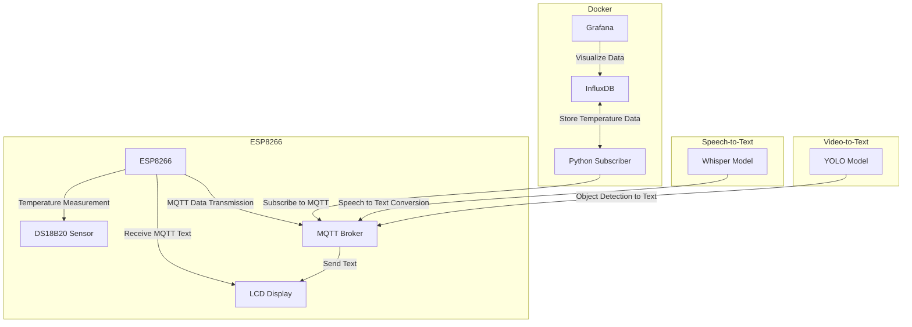
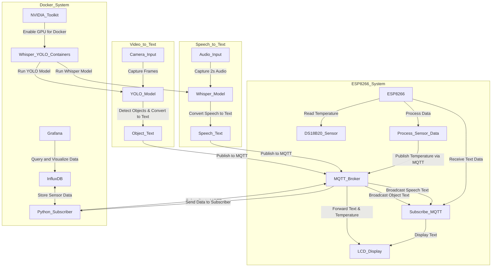

# IoT-and-Cloud-Computing

### Description
This application utilizes the OpenAI Whisper model to capture 2-second audio segments from the default input device and display the transcribed speech. It is compatible with both CPU and CUDA, with a dedicated function for selecting the appropriate mode to prevent crashes. The application requires Linux for dockerization. Although there are tokens and SSL certificates in the code, they are included solely for testing purposes, so no worries.

### Linux required for easier installation, making docker can read microphone from windows is quite complicated

## Installation on linux Debian12

### Requirements:
- Python 3.11.8 !! important
- Make venv and
- Install requirements.txt
- SSL cert for MQTT connection in /python_scripts/MQTTcert.crt

### CUDA Requirements
- CUDA 12.6, V12.6.77
- nvhpc_2024_2411_Linux_x86_64_cuda_12.6.tar.gz
- cudnn/9.5.1/local_installers/cudnn-local-repo-debian12-9.5.1_1.0-1_amd64.deb
### Run
1. Set correct values main.py
2. Using >Real_Time_whisper_IoT/python_scripts/.venv/bin/Python3.11 main.py

## DOCKER install
### Requirements
1. Docker
2. NVIDIA Container Toolkit for docker so it can read GPU
3. SSL cert for MQTT connection in /python_scripts/MQTTcert.crt

### Instructions whisper_RealTime
1. cd whisper_realTime
2. sudo docker build -t whisper_realTime .

### Whisper_RealTime run:
sudo docker run --gpus all --device /dev/snd:/dev/snd --rm -it whisper-audio-app

### Instructions YOLOv8
1. cd YOLOv8
2. sudo docker build -t yolo-app .

### YOLOv8 run:
sudo docker run --rm --device=/dev/video0:/dev/video0 yolo-app

## Grafana 'n influx stats server setup and run
1. cd grafana_influx_stats
2. sudo docker compose up --build

## Temperature setup

### I2C LCD wireing
VCC -> VV GND -> G SCL -> D1 SDA -> D2

### DallasTemperature sensor wireing
Middle Pin (data) -> D3 GND -> GND VCC -> 3V with resistor
